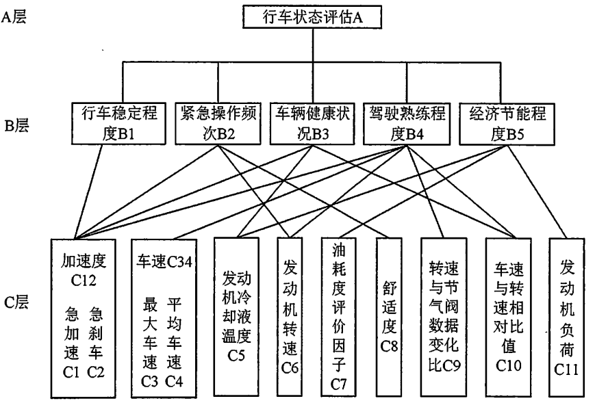
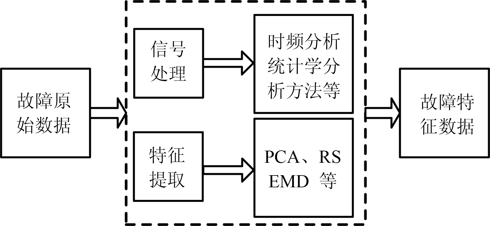
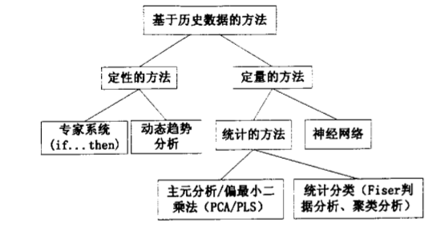
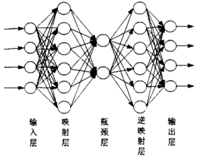

# FaultDiagnosis

## 1.资料汇集

[监督学习笔记整理](./SupervisedFDD.md)

[无监督学习笔记整理](./UnsupervisedFDD.md)

[经典统计学笔记整理](./Statistics.md)

[概念](./SomeConcept.md)

## 2.前期论文阅读

### 基于智能手机的汽车故障诊断系统研究与开发（2011 汽车工程 武理）

* **研究内容**

  利用OBD系统基于智能手机平台的汽车故障诊断系统。手机诊断程序通过避循SAE J2534标准的VCI（Vehicle Communication Interface）系统与车内电子控制单元进行通信，获取汽车故障代码及汽车内部实时状态数据。由智能手机对诊断数据进行处理和管理、并整合诊断辅助功能。通过实际测试验证了整个系统性能。

### 基于小波变换的电动汽车用电机轴承故障诊断研究（2019 贵大 硕）

* **研究内容**

  （1）电动汽车的发展趋势和轴承故障诊断技术及其故障特征提取方法的国内外研究现状

  （2）其次根据轴承故障对永磁同步电动机运行参变量(振动、电流)的影响，详细分析轴承故障发生后电机内部参变量的变化情况，推导轴承不同故障时定子电流频谱中对应的特征频率

  （3）建立了具有轴承故障的电机模型，利用`Matlab/Simulink`软件建立了基于永磁同步电动机的电动汽车电驱动系统的仿真系统，并仿真运行获取其定子电流数据，分析验证了仿真系统的正确性

  （4）基于小波变换适用于处理瞬变、非平稳信号的特点，采用其分析电机定子电流，分析其时频域特征信息与电机轴承故障的对应关系，提取电流中隐含的故障特征，实现电机轴承的故障诊断仿真试验证明了该方法的有效性

* **可用技术**

  **（1）轴承故障诊断特征信息提取方法**

  1.传统傅里叶变换的频域分析方法，使用于平稳信号的分析

  2.可移动的时间窗进行傅里叶变换（短时傅利叶变换），时间窗函数固定，不能在时间与频率上同时达到最优

  3.小波变换，可变时间窗函数，使小波变换既能分析非平稳信号中的高频分量，又能分析分辨率较好的低频分量

  4.经验模态分解(EMD)方法，将非平稳信号分解为有限的调频调幅分量一本征模态函数(IMF)，其能有效地处理非线性和非平稳信号，具有同时在时域和频域获得较高的分辨率的优点，缺点是 EMD 具有不可避免的边界效应。

### 基于UDS的行车状态评估系统的研究（2018 华中师 硕）

* **研究内容**

  （1）分析了驾驶人员环境感知一大脑决策一操作执行的循环中驾驶状态与环境感知的联系。基于层次分析法(Analytic HierarchyProcess，AHP)建立行车状态多维决策模型，提出安全性、经济性、舒适性三维评价体系。

  （2）基于UDS(Unified Diagnostic Services，统一诊断服务)设计车载信息采集设备和预处理数据提取特征方案，驾驶数据来源于真实路况下车载信息采集设备读取的实时行车信息

  （3）段利用MATLAB工具平台搭建AHP—SVM行车状态评估模型，将行车状态分类成良好和不良两大类。

  （4）分析危险行车状态评价标准，基于支持向量机(Support Vector Machine，sVM)建立危险状态评估模型，识别行车状态中的危险状况。

* **创新点**

  (1)本文提出从驾驶环境、驾驶车辆和驾驶人员三个层面考虑影响行车状态的因素。

  (2)本文基于AHP提出从驾驶安全性、驾驶经济性和驾驶舒适性分析驾驶状态决策过程的的参考指标。

  (3)基于驾驶数据特征分析提出AHP—SVM行车状态决策算法，该算法利用机器学习算法分析驾驶状态参数、驾驶状态指标变化趋势性，从驾驶状态指标相互关联性出发，**构建了良好、不良和危险三大类行车状态分类判定方法**。

* **可用技术**

  * 高斯混合算法

    hiyomi Miyajima等人采用驾驶员踩刹车踏板和油门踏板的数据，提出运用高斯混合算法建模针对性研究驾驶员的急加速和急减速行为，模型准确率约80%

  * SafeDrive

    Mingming Zhang等人提出SafeDrive一种在线的、无监督的状态感知的异常驾驶检测方法。分别采用HMM(隐马尔科夫模型)和SVM算法检测异常驾驶。SafeDrive标识一个数据段明显偏离SG作为一个异常处理，及时提醒驾驶员进行纠正其驾驶行为

    *SafeDrive:Online Driving Anomaly Detection From Large-Scale Vehicle Data*

  * 层次分析法AHP

    层次分析法是一种解决多目标的复杂问题的定性与定量相结合的决策分析方法。该方法将定量分析与定性分析结合起来，用决策者的经验判断各衡量目标之间能否实现的标准之间的相对重要程度，并合理地给出每个决策方案的每个标准的权数，利用权数求出各方案的优劣次序，比较有效地应用于那些难以用定量方法解决的课题。

    

    

### MODEL-BASED SENSOR FAULT DIAGNOSIS OF VEHICLE SUSPENSIONS WITH A SUPPORT VECTOR MACHINE（2019 ）

### 汽车发动机失火故障诊断方法研究综述

* **可用技术**

  **（1）基于数据的失火故障诊断方法**

  神经网络、小波分析、遗传算法、经验筛选（Empirical mode decomposition, EMD）、粒子群优化算法（Partical swarm optimization, PSO）、支持向量机、相关向量机（Relevance vector machine, RVM）、极限学习机（Extrem e Learning machine, ELM）、模糊理论（Fuzzy theory）、灰色关联分析（Grey relational analysis, GRA）

  **1.1)数据预处理（信号处理和特征提取两部分）**

  

  以下是信号处理部分：

  *非负矩阵分解*：的特征提取方法对信号进行压缩，计算用于发动机故障诊断的特征参量（《非负矩阵分解在发动机故障特征提取中的应用》）。

  *Gabor变换*：分别分别对失火和正常情况下的瞬时角速度进行了时域分析，计算量大，但可以简化时域成分幅值，想对于时域分析和高速情形，诊断效果有明显的提高。（《Instantaneous Engine Speed Time-Frequency Analysis for Onboard Misfire Detection and Cylinder Isolation in a V12 High-Performance Engine》）

  *小波分析*：处理曲轴速度，在发动机高速状态时，诊断精度有所提高。（《Diesel Misfire Fault Diagnosis Using Vibration Signal over Cylinder Head》）

  *小波包分析*：可将原始数据划分为不同精细频段上相异的特征信号，进而运用集成神经网络信息融合算法，实现了对失火故障的诊断，避免了在物理意义上对信号进行分类带来的误判划分。（《基于神经网络信息融合的发动机失火故障诊断》乔新勇 , 刘建敏 , 张小明）

  *频谱分析和模糊逻辑*：频谱分析使用快速傅利叶变换，快速提取失火时曲轴速度所有振动信号特定的频域特征，模糊逻辑提供了一个在重要性和精度间的良好平衡，降低了干扰噪声和**不平路段绕动引起的误警率**。

  以下是特征提取部分：

  *归一化处理*

  *主成分分析、粗糙集*：实现冗余信息的约简。（《基于主成分分析和集成神经网络的发动机故障诊断模型研究》《基于粗糙集与 BP 神经网络的发动机故障诊断模型》李增芳 何 勇  《基于粗糙集与支持向量机的发动机故障诊断研究》周瑞; 杨建国）

  **1.2）结合神经网络的失火故障诊断**

  *BP神经网络*：在高压共轨式电控柴油机故障诊断中的应用

  *RBF神经网络*：比BP更快

  *增量式学习神经网络*：相比与BP神经网络，具有在线增量式学习能力，不遗忘系统已有的专家知识，失火检测能力好，可实现在线和离线失火故障检测。

  **1.3）结合多种算法的失火故障诊断**

  **（2）基于模型的失火故障诊断方法**

  **（3）基于数据和模型相结合的失火故障诊断方法**

### 汽车线控转向系统容错和故障诊断技术综述（2015 中石油大 重庆交通大学学报）

* **可用技术**

  （1）粗糙集

  用粗糙集模型简化冗余信息,抽取分类规则。设计利用粒子群优化方法优化的径向基神经网络，学习冗余信息简化抽取的故障规则。Matlab仿真表明，智能故障诊断方法提高了诊断精确水平。

  > 粗糙集理论的主要思想是利用已知的知识库，将不精确或不确定的知识用已知的知识库中的知识来（近似） 刻画。

  （2）自适应粒子群优化算法

  基于改善的自适应粒子群优化算法动态改变惯性权重和阈值，根据粒子成熟收敛度和粒子适应度自适应调整粒子的惯性权重，训练神经网络，建立了故障诊断模型。与粒子群优化算法和遗传算法相比，有效改善了神经网络训练效率，获得了较好的诊断结果

### 基于指定元分析的多故障诊断方法（2009 自动化学报）

为了克服传统主元分析 (Principal component analysis, PCA) 因模式复合现象而无法进行多故障诊断和诊断结果难以解释的不足 , 本文引入指定元分析 (Designated component analysis, DCA) 的思想 , 建立 DCA 多故障诊断理论的空间投影框架 , 从而把异常检测问题转化为将观测数据向故障子空间投影后投影能量的显著性检测问题 .

### 未知多故障诊断的扩展指定元分析方法（2009 华科学报）

* **可用技术**

  （1）PCA

  （参考《基于数据驱动的流程工业性能监控与故障诊断研究》郭明 浙大博士论文）

  PCA 的 模式复合效应使得它只能做异常检测 , 而无法很好地进行故障模式辨识和多故障的诊断

  （2）指定元分析DCA（《基于指定元分析的多故障诊断方法》周福娜）

  知识导引 、多变量统计特征提取工具，避免 PCA 的模式复合效应 , 使故障诊断结果具有明确的物理意义**但是通过将观测数据向指定故障模式方向投影实现故障诊断，当系统中包含事前未定义的新故障情况时 , 已有 DCA 方法无法很好地诊断**

  （3）拓展DCA方法（《未知多故障诊断的扩展指定元分析方法》周福娜）

  分为新故障的检测 ; 新故障方向的估计

### 基于数据驱动的流程工业性能监控与故障诊断研究（2004 浙大 博）

* **研究内容**

  1.用多变量核密度估计方法,研究了参数不确定条件下,过程数据的分布及其对系统监控性能的影响。

  2.基于独立分量分析（ICA）和支持向量机（SVM）的对系统性能进行监控的框架，包括特征提取和故障识别两部分

  3.出以主元子空间相互之间的距离来识别不同的工况。不同的主元子空间代表了不同的操作模式和工况。

  4.出了一种基于模型的多尺度间歇过程性能监控方法。

  5.提出了多向Fisher判据分析(MFDA)的方法用于间歇过程监控。

  6.探讨了在计算机集成过程系统(C口s)下过程性能监控系统的集成框架体系

* **可用技术**

  

  

  （1）独立分量分析

  用来从当前工况的数据矩阵中提取出代表当前工况特征的投影系数矩阵。投影系数矩阵被用来训练多个支持向量机，从而利用它们实现故障类型的识别。

  （2）支持向量机

  支持向量机在小样本学习方面具有良好的范化能力。

  （3）基于主元得分贡献图以及基于最大特征方向夹角的故障识别方法

  待调研

* **数据驱动的问题**

  （1）数据质量

  噪声、传感器故障

  （2）数据大小

  实际只采集关键几个数据，其他数据包含的信息丢失。

  （3）数据共线性

  变量相关性高，大多数工业可以使用较少的维数来描述。（**正好可以用来识别传感器的故障**）

  （4）数据时变性

  不同的外部变化，往往使得过程工作在多个不同的稳态操作点（**比如ECAS根据实际的情况，调整汽车的高低**）

  （5）数据多尺度

  某些扰动对过程的影响可能是短时的,而有些扰动对过程的影响可能更长更慢。而有关扰动时间尺度的信息有助于扰动的识别,作出正确的校正措施。有人提出了尺度自适应的RNN、设计RNN的门可以丢弃不重要的信息等方法[关于多尺度的资料](https://zhuanlan.zhihu.com/p/58388531)。

  Bakshi（1998）提出的多尺度PCA（MSPCA, Multiscale PCA），利用小波将每一信号分解为多个尺度上的信号，在每一尺度上分别建立相应的模型，剔除相应于噪声部分的小波系数，然后在此基础之上重构出原始信号。

  （6）数据非线性

  Kramer（1991）提出基于神经网络的非线性PCA（NLPCA）。中间的瓶颈层类似于PCA中主元的个数少于原始变量的个数，瓶颈层的输出即为非线性主元。
  
  
  
  
  
  （7）数据动态特征
  
  时间序列，当前时刻的测量与先前时刻的测量不是独立的。

### 基于深度卷积神经网络的未知复合故障诊断（2019 中国科技论文）

