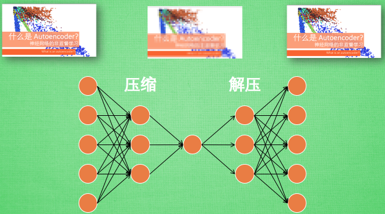

# SomeConcept

## 故障名词

故障检测(Fault Detection)：实时监测过程数据，判断是否发生故障。

故障识别(FaultIdentification)：发生故障后，找出与该故障最有关联的观测变量。

故障诊断(Fault Diagnosis)：判断发生哪种故障，具体为确定故障的类型、故障的量级、故障发生的位置和时间。

## 自编码

### 2.1.1 介绍

### 2.1.2参考文献

[1] [什么是自编码](https://morvanzhou.github.io/tutorials/machine-learning/tensorflow/5-11-A-autoencoder/)