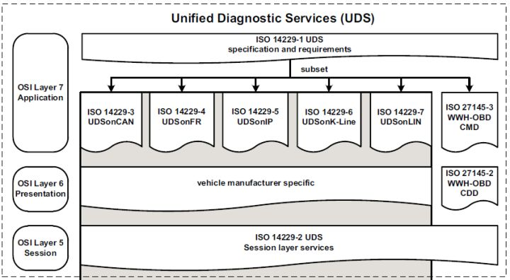
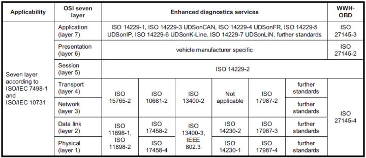

# UDS

## 1.简介

UDS（Unified Diagnostic Services，统一的诊断服务）诊断协议是ISO 15765 和ISO 14229 定义的一种汽车通用诊断协议，位于OSI模型中的应用层（有点问题，不光是应用层，见下图UDS的协议层次），它可在不同的汽车总线（例如CAN， LIN， Flexray， Ethernet 和 K-line）上实现。UDS协议的应用层定义是ISO 14229-1，目前大部分汽车厂商均采用UDS on CAN的诊断协议。

UDS本质上是一系列的服务，共包含6大类26种。每种服务都有自己独立的ID，即SID。

- SID：Service Identifier，**诊断服务ID**。UDS本质上是一种定向的通信，是一种交互协议（Request/Response），即诊断方给ECU发送指定的请求数据（Request），这条数据中需要包含SID。
- 如果是肯定的响应（**Positive Response**），回复`[SID+0x40]`，如请求10，响应50；请求22，响应62。
- 如果是否定的响应（**Negative Response**），回复**7F+SID+NRC**，回复的是一个声明。

## X.UDS和OBD的区别

* OBD

  OBD(On-Board Diagnostic)起源于CARB(California Air Resources Board 加州空气资源委员会)。OBD II汽车都需要具备**标准化**的车辆数据诊断接口(SAE-J1962，也就是现在常说的OBD接口)、标准化的诊断解码工具(SAE-J1978)、标准化的诊断协议(ISO 9141-2\ISO 14230-4\ISO 15765-4)、标准化的故障码定义(SAE-J2012\ISO 15031-6)、标准化的维修服务指南(SAE-J2000)。具有**强制**标准参照。

* UDS

  UDS(Unified diagnostic services)，与OBD最大的区别就在于“Unified”上，它是面向整车所有ECU(电控单元)的，而OBD是面向排放系统ECU的。UDS包含了ISO 14229下属的7个子协议，其中ISO 14229-2还是会话层的，所以**UDS仅包括应用层的说法也是错误的**（见图），可以基于CAN、FR、LIN等通信方式实现。UDS提供的是一个诊断服务的基本框架，主机厂和零部件供应商可以根据实际情况选择实现其中的一部分或是自定义出一些私有化的诊断服务来。

下图为UDS和OBD的协议层次对比。

**ISO 15765-2协议**（网络层）解决了CAN传输多帧的需求（**补充**：重型车辆应用车载诊断系统有两种通讯协议：ISO 15765-4:2005 以及 SAE J1939-73）

CAN物理层和数据链路层遵循**ISO 11898**协议