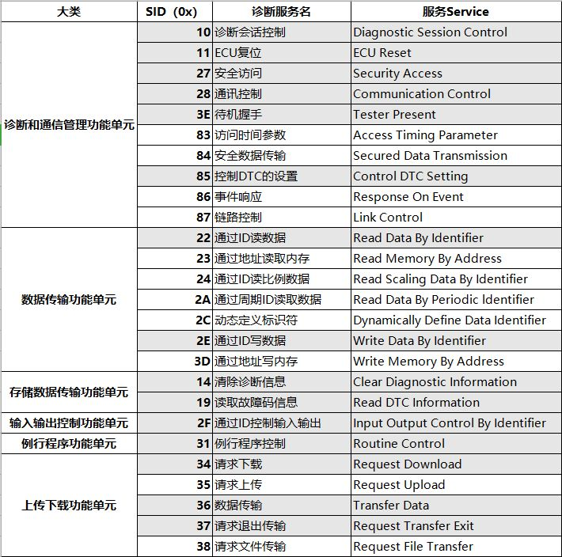

# UDS

## 1.简介

UDS（Unified Diagnostic Services，统一的诊断服务）诊断协议是ISO 15765 和ISO 14229 定义的一种汽车通用诊断协议，位于OSI模型中的应用层（有点问题，不光是应用层，见下图UDS的协议层次），它可在不同的汽车总线（例如CAN， LIN， Flexray， Ethernet 和 K-line）上实现。UDS协议的应用层定义是ISO 14229-1，目前大部分汽车厂商均采用UDS on CAN的诊断协议。

UDS本质上是一系列的服务，共包含6大类26种。每种服务都有自己独立的ID，即SID。

- SID(Service Identifier)

  **诊断服务ID**。UDS本质上是一种定向的通信，是一种交互协议（Request/Response），即诊断方给ECU发送指定的请求数据（Request），这条数据中需要包含SID。

  交互格式为

  

- 如果是肯定的响应（**Positive Response**），回复`[SID+0x40]`，如请求10，响应50；请求22，响应62。

- 如果是否定的响应（**Negative Response**），回复**7F+SID+NRC**，回复的是一个声明。

## 2.UDS的SID

共26个SID，如下图。

在J14229中的缩写，M：强制；C：有条件的（有的请求/回应会包括该部分内容）；S：参数强制，除非额外定义；U：用户可选择的。

网络层`N_PDU =N_PCI+N_DATA`, `N_PCI`的值主要集中的前三个字节，具体的网络层定义为，

| 帧类型 | bit7-4    | bit3-0 | Byte 2 | Byte 3 |
| :----- | :-------- | :----- | :----- | :----- |
| 单帧   | PCItype=0 | SF_DL  | N/A    | N/A    |
| 首帧   | PCItype=1 | FF_DL  | FF_DL  | N/A    |
| 连续帧 | PCItype=2 | SN     | N/A    | N/A    |
| 流控帧 | PCItype=3 | FS     | BS     | ST_min |

- `SF_DL` 代表单帧中数据字节数（取值0-7），
- `FF_DL`代表 连续帧中的数据字节数(12bit可表四8~4095)，
- `SN`代表此帧为连续帧中的第几帧，（0、1、2...E、F、0、1...）
- `FS`流控制帧，有三种状态：继续发送0、保持等待1、数据溢出2
- `BS`规定发送端允许持续传输连续帧数目的最大值（0~255），
- `STmin`限定连续帧相互之间所允许的最小时间间隔。

### 2.1 读取故障码（DTC）- 0x19

故障码包括四个大类，分别是PCBU，P是powertrain动力系统，C是Chassis底盘，B是Body车身，U是network通信系统。DTC码分为4个字节，如下所示。

前2个字节DTCHighByte(Hex)和DTCMiddleByte(Hex)表示故障内码，分割为5位标准故障码（如下图所示）。第1位是字母，2到5位是数字。

（1）**第一位**，字母，表示**故障所属系统**

| 故障内码(Bit15 Bit14) | 标准故障码的表示字符 | 所属系统                 |
| --------------------- | -------------------- | ------------------------ |
| 00                    | P                    | Powertrain：动力系统故障 |
| 01                    | C                    | Chassis：底盘故障        |
| 10                    | B                    | Body：车身故障           |
| 11                    | U                    | Network：网络故障        |

（2）**第二位**，数字，表示**故障类型**

| 故障内码(Bit13 Bit12) | 标准故障码的表示字符2 | 故障类型                |
| --------------------- | --------------------- | ----------------------- |
| 00                    | 0                     | ISO/SAE标准定义的故障码 |
| 01                    | 1                     | 制造商自定义的故障码    |
| 10                    | 2                     | ISO/SAE预留             |
| 11                    | 3                     | ISO/SAE预留             |

（3）**第三位**，数字，表示**故障所属的子系统**，对于**动力系统（P）**而言

- 0：表示燃油和空气计量辅助排放控制整个系统；
- 1：表示燃油和空气计量系统；
- 2：表示燃油和空气计量系统（喷油器）；
- 3：表示点火系统；
- 4：表示废气控制系统；
- 5：表示巡航、怠速控制系统；
- 6：车载电脑和输出信号；
- 7：传动系统控制；
- 8：传动系统控制；

（4）第四五位，数字，表示**具体故障对象和类型**

## X.UDS和OBD的区别

* OBD

  OBD(On-Board Diagnostic)起源于CARB(California Air Resources Board 加州空气资源委员会)。OBD II汽车都需要具备**标准化**的车辆数据诊断接口(SAE-J1962，也就是现在常说的OBD接口)、标准化的诊断解码工具(SAE-J1978)、标准化的诊断协议(ISO 9141-2\ISO 14230-4\ISO 15765-4)、标准化的故障码定义(SAE-J2012\ISO 15031-6)、标准化的维修服务指南(SAE-J2000)。具有**强制**标准参照。

* WWH-OBD

  

* UDS

  UDS(Unified diagnostic services)，与OBD最大的区别就在于“Unified”上，它是面向整车所有ECU(电控单元)的，而OBD是面向排放系统ECU的。UDS包含了ISO 14229下属的7个子协议，其中ISO 14229-2还是会话层的，所以**UDS仅包括应用层的说法也是错误的**（见图），可以基于CAN、FR、LIN等通信方式实现。UDS提供的是一个诊断服务的基本框架，主机厂和零部件供应商可以根据实际情况选择实现其中的一部分或是自定义出一些私有化的诊断服务来。

下图为**UDS协议层次**，图中的WWH-OBD和OBD不同。

**ISO 15765-2协议**（网络层，**使用CAN数据帧的第3个字节**）解决了CAN传输多帧的需求（**补充**：重型车辆应用车载诊断系统有两种通讯协议：[ISO 15765-4:2005 以及 SAE J1939-73](../CAN_Network_Layer/CAN_Network_Layer.md)）

CAN物理层和数据链路层遵循**ISO 11898**协议

下面是**OBD 、 WWH-OBD和UDS的对比**

>It has been established in order to apply the unified diagnostic services (specified in ISO 14229-1) to WWH-OBD systems.
>
>UDS会应用到WWH-OBD中。

对于WWH-OBD的理解——参考UDS，规定了DoCAN、DoIP的诊断服务。