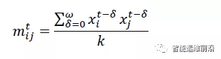
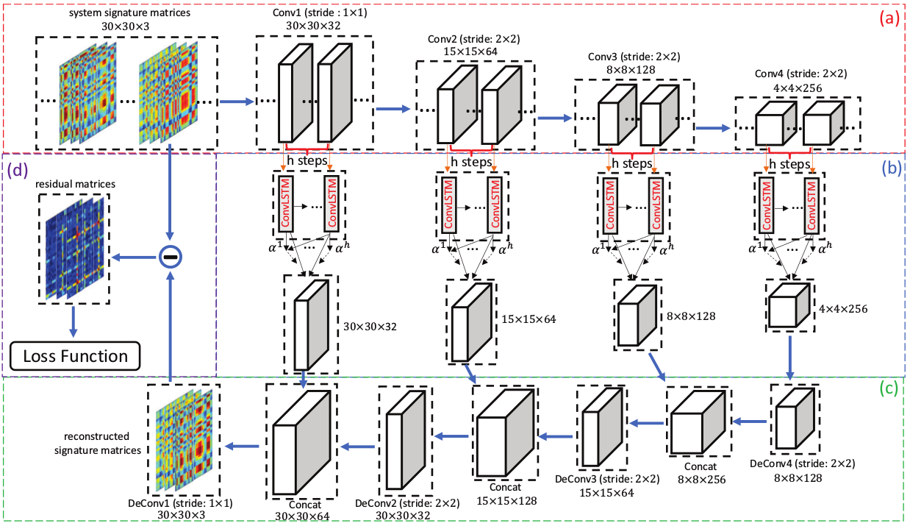

# Unsupervised FDD

## 1.Conv-LSTM（MSCRED）

### 1.1 介绍

LSTM可以捕捉时间序列中的时序依赖关系。

* **预处理**

  首先根据输入的时序数据构造特征矩阵。t为时间点，delta取值`0-omega`，也就是取t时刻前面omega

  个数据。

  

  有如下优点：

  - 第一，如果不同特征上的噪声是彼此无关的，相关计算可以消除这些噪声的影响，这可以消除一部分与感兴趣的系统状态无关的噪声，例如传感器的测量误差等。
  - 第二，可以通过观察特征图上各个位置的重建误差分布便捷地对产生异常的特征进行定位，如果单个特征中出现异常，那么其在特征图上对应的一行和一列很可能会出现很大的重建误差。
  - 第三，可以通过比较不同时间尺度特征矩阵的重建误差推断误差的严重程度，如果短时间尺度的特征矩阵重建误差较大，而长时间尺度的特征矩阵的重建误差并不显著，那么就可以认为这是一次持续时间较短的异常。

* **网络架构**

  网络将上述结构进行降维和重建。Encoder 和 Decoder 分为彼此对称的多级。在 Encoder 的每一级中，模型首先让原始特征图或上一级输入经过一层卷积，而后将输出结果通过 Conv-LSTM 层，最后使用**注意力机制**从 Conv-LSTM 各步的隐藏层状态中获取当级输出特征。在 Decoder 的每一级，首先将 Decoder 上一级的输出特征和 Encoder 对应一级的输出特征级联，再经过一层反卷积得到输出。逐级重建得到原始特征图，并使用特征图重建误差的 2 范数作为训练的目标函数。

  

  通过卷积层，模型试图捕捉时序数据中各特征间的关系，通过 Conv-LSTM 层，模型试图进一步捕捉数据中时序相关的关系。Decoder 使用 Encoder 中每一级提取的特征而不是仅依靠最后一级的特征的做法，与物体分割领域的做法是相似的，这使得模型能综合利用不同尺度的信息对数据进行重建。

### 1.2 参考文献

1. *A Deep Neural Network for Unsupervised Anomaly Detection and Diagnosis in Multivariate Time Series Data*  2019
2. [注意力机制是什么？](https://www.zhihu.com/question/304499365)
3. *Attention Is All You Need* 2017

### 1.3 改进点

如何实现不同采样频率的数据处理？

## 2.DCN

DCN = Deep & Cross Network

### 2.1 介绍

DCN延续了*基于某种距离度量计算样本间距离*和*基于无监督聚类*的思路，通过结合 AutoEncoder 和 k-means 来同时获得高质量的降维和低维聚类结果，即通过训练神经网络得到用于聚类的距离度量。

### 2.2 参考文献

1. *DCN:Deep & Cross Network for Ad Click Prediction*

## 3.DAGMM

DAGMM = Deep Autoencoding Gaussian Mixture Model

### 3.1 介绍

DAGMM延续了*估计正常样本分布的概率密度*的思路，通过结合AutoEncoder 和 GMM 模型，来同时获得高质量的降维和低维分布概率密度。

### 3.2 参考文献

1. *Deep Autoencoding Gaussian Mixture Model for Unsupervised Anomaly Detection*