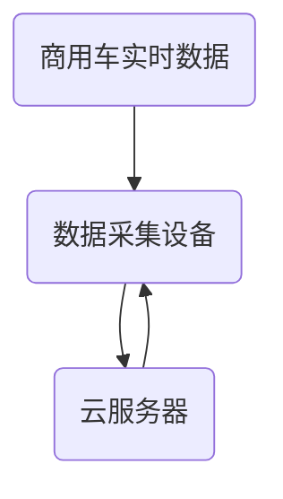
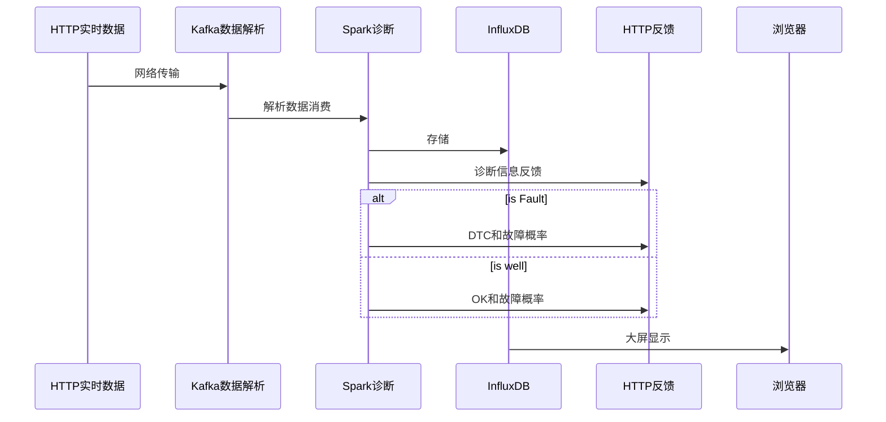

# 基于数据挖掘的商用车故障诊断平台设计与实现

## 1.当前研究现状

### 1.1 研究背景

**背景**

> 真实世界运行的系统，例如发电厂、可穿戴设备等产生的时间序列数据的规模正在急剧增长，从这些为监控系统运行情况而采集的数据中推断出特定时刻系统的异常是对系统进行及时的维护和修复所必须的。例如，如果能从发电厂传感器输出数据中及时发现设备故障，就有可能避免断电引发的危险和损失。但是，简单的故障告警往往不足以解决现实世界中复杂的问题。第一，我们需要细粒度的警告，通过根因分析定位具体哪一条或哪几天时间序列数据中包含异常，以方便维护人员介入后能高效地对系统进行检测和修复；第二，我们需要区分不同严重程度的异常，对于程度较轻，有可能通过系统自动修复的异常和程度较重，需要维护人员立刻介入的异常，如果使用完全相同的警告，就有可能对维护人员造成不必要的负担，造成资源的浪费。—— *A Deep Neural Network for Unsupervised Anomaly Detection and Diagnosis in Multivariate Time Series Data*

**挑战**

* 多元时间序列中同时包含时序依赖和特征间的相互关系，因此将适用于非时序数据的算法直接用于时序数据很有可能会因为不能提取时序信息而失效。
* 实际应用中的多元时间序列通常会含有噪声，噪声会影响时序预测模型的泛化能力，例如自回归滑动平均模型(ARMA) 和 LSTM 自动编解码器等，从而使其检测精度下降。
* 真实应用场景对于细粒度的异常结果有实际的需求，细粒度则包含根因分析和严重程度判断两个方面，现有的根因方法，如 RCA 等，对于噪声敏感，因此不能解决这一问题。

### 1.2 国内外研究现状

**目前的商用车故障诊断现状**

1.OBD/[UDS](../FaultDiagnosis/UDS/UDS.md)仍然存在准确率不高的问题

2.现代车辆大多采用自诊断技术,通过ECU模块来设置故障自诊断系统

3.UDS相对来说还是一个比较封闭的系统

4.UDS记录故障时，不会记录采集到的数据，后期难以分析

**基于数据分析的方法**（在实际中还没有使用，5G车联网时代）

在深度学习方法得到广泛应用之前，传统的异常检测方法可以分为三类:

- 基于某种距离度量计算样本间距离，例如 kNN。
- 基于无监督聚类。
- 估计正常样本分布的概率密度，例如 One-Class SVM。

## 2.技术研究内容

### 2.1 已知故障的分类

### 2.2 未知故障的预警

#### 2.2.1 EDCA

参考《未知多故障诊断的扩展指定元分析方法（2009 华科学报）》

### 2.3 故障分类

半监督学习

关联关系体现故障类型

### 2.4 实时更新模型（目前不准备做这一块）

模型更新前后的准确率是否不断提升

*增量式学习神经网络*

### 2.5 平台设计

#### 2.5.1 平台架构

Java不断读取本地的数据，更新各个已知错误和位置错误的出现概率，数据和概率都写入到InfluxDB中。可以通过InfluxDB显示出来。本程序可以部署在本地展示，正式使用时，可以部署到远程。

#### 2.5.2 工程问题

* **如何自动识别不同的数据？**

  创建信息模型，用一个Map保存（每个CanId对应一个解析方法），这些解析方法可以持久化（数据库），使用的时候，可以保存在Redis中（由于数据实时性较高，并没有必要保存在Redis中管理，直接全部读取到自行创建的Map即可）。

## X.我的问题

* 瑞立使用J1939协议如何实现UDS？

  CAN通信是设置目的地址，一个一个获取DTC？

  以此引伸出一个问题，平台还需要知道每个ID代表的数据类型。是否可以考虑制作一张表，自动识别？

* J1939如何实现多帧组合？

  因为8字节存不下UDS的一些反馈信息。**在网络层使用J15765-4协议，占用CAN数据位的第1位**

× 