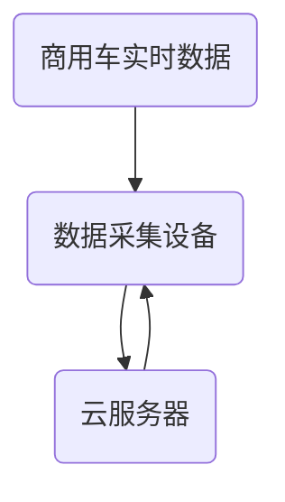
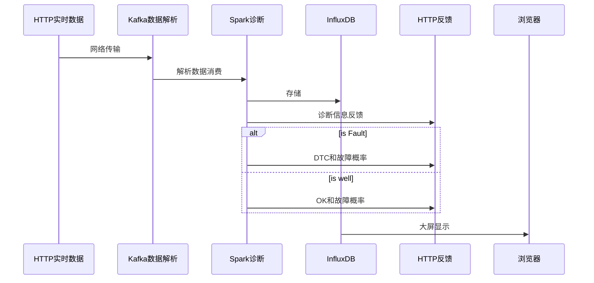

# 基于数据挖掘的商用车故障诊断平台设计与实现

## 1.当前研究现状

1.OBD/[UDS](../FaultDiagnosis/UDS/UDS.md)仍然存在准确率不高的问题

2.现代车辆大多采用自诊断技术,通过ECU模块来设置故障自诊断系统

3.UDS相对来说还是一个比较封闭的系统

4.UDS记录故障时，不会记录采集到的数据，后期难以分析

## 2.技术研究内容

### 2.1 已知故障的分类

### 2.2 未知故障的预警

#### 2.2.1 EDCA

参考《未知多故障诊断的扩展指定元分析方法（2009 华科学报）》

### 2.3 传感器故障的识别

传感器故障往往引起的效益是单一的，其他关联数据不改变。也就是说如果关联关系失配，有两种情况：传感器故障（其他数据的关联关系未被打破，并在正常范围内）、某设备故障（其他数据的关联关系被打破，或者超出了正常范围）。

### 2.4 实时更新模型

模型更新前后的准确率是否不断提升

*增量式学习神经网络*

## 3.平台

### 3.1 平台架构

Java不断读取本地的数据，更新各个已知错误和位置错误的出现概率，数据和概率都写入到InfluxDB中。可以通过InfluxDB显示出来。本程序可以部署在本地展示，正式使用时，可以部署到远程。

### 3.2 工程问题

* **如何自动识别不同的数据？**

  创建信息模型，用一个Map保存（每个CanId对应一个解析方法），这些解析方法可以持久化（数据库），使用的时候，可以保存在Redis中（由于数据实时性较高，并没有必要保存在Redis中管理，直接全部读取到自行创建的Map即可）。

## X.我的问题

* 瑞立使用J1939协议如何实现UDS？

  CAN通信是设置目的地址，一个一个获取DTC？

  以此引伸出一个问题，平台还需要知道每个ID代表的数据类型。是否可以考虑制作一张表，自动识别？

* J1939如何实现多帧组合？

  因为8字节存不下UDS的一些反馈信息。**在网络层使用J15765-4协议，占用CAN数据位的第1位**

